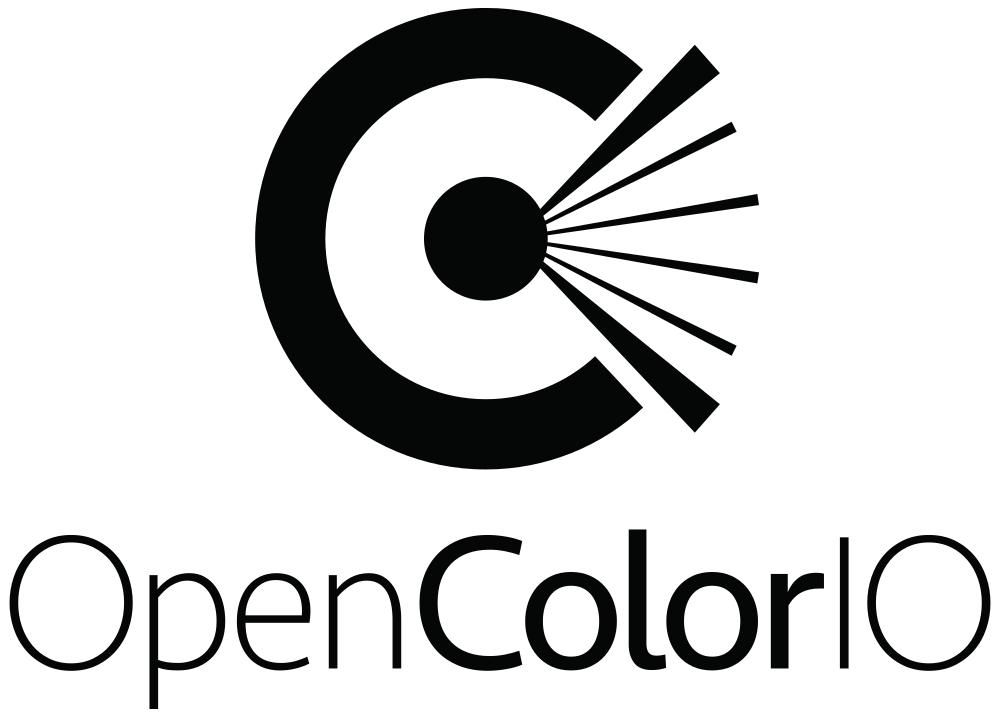
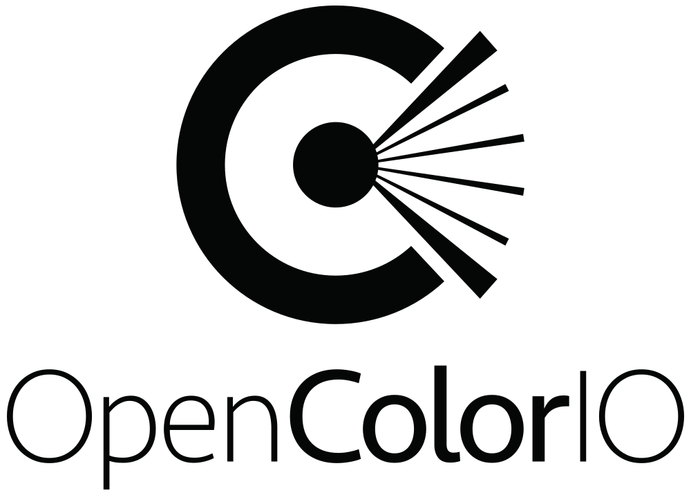
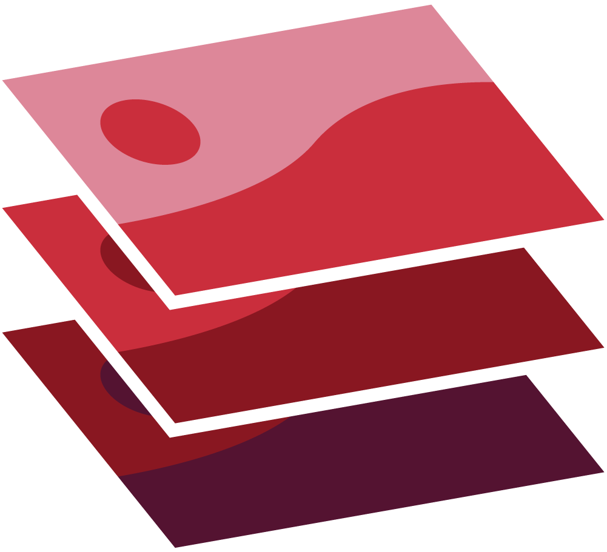
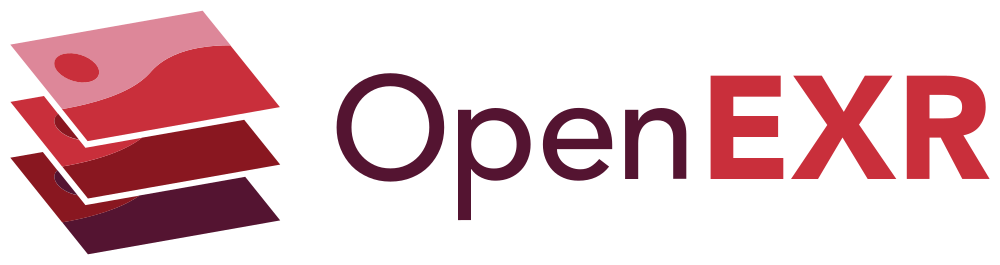
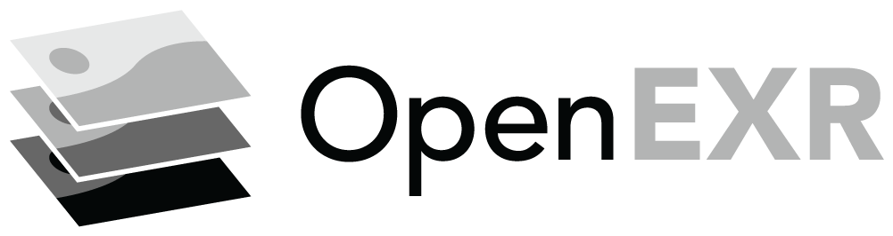
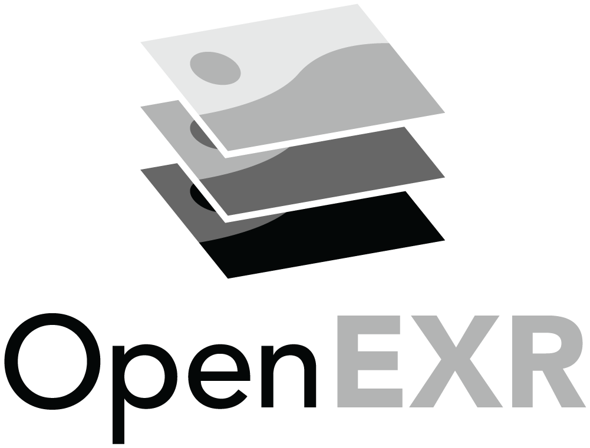
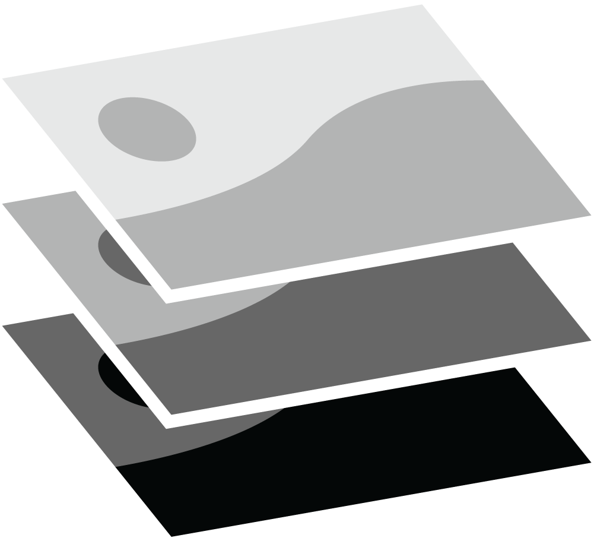
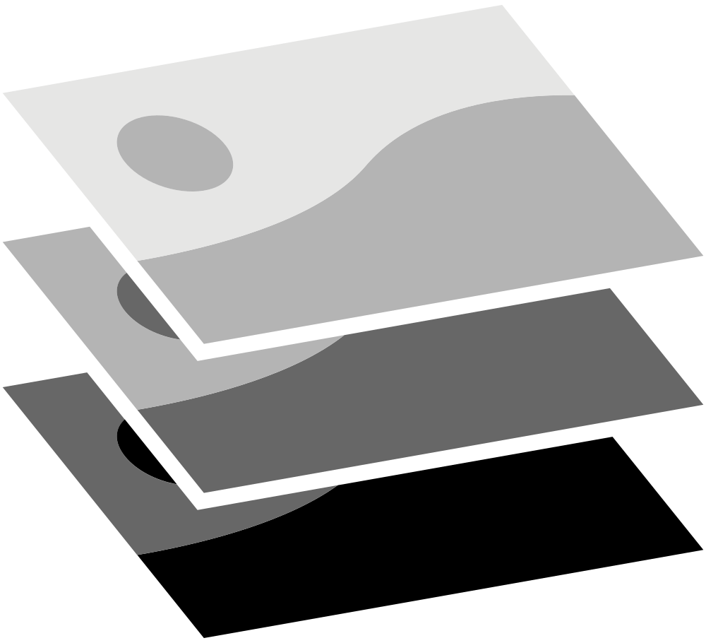
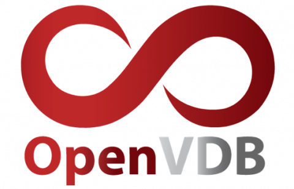

## Academy Software Foundation (ASWF) Adopted Project Logos

*Note: GitHub Flavored Markdown used in the Readme doesn't support background colors. The white logos below are displayed on the light grey of tables.*

### OpenColorIO Logos
<table>
    <tr>
        <th></th>
        <th>PNG</th>
        <th>SVG</th>
    </tr>
    <tr>
        <th>color</th>
        <td><a href="../projects/opencolorio/opencolorio-color.png" download="opencolorio">

</a></td>
        <td><a href="../projects/opencolorio/opencolorio-color.svg" download="opencolorio">

</a></td>
    </tr>
</table>

### OpenEXR Logos

<table>
    <tr>
    	<th colspan="7"></th>
    </tr>
    <tr>
        <th></th>
        <th colspan="3">PNG</th>
        <th colspan="3">SVG</th>
    </tr>
    <tr>
        <th></th>
        <th>horizontal</th>
        <th>stacked</th>
        <th>icon</th>
        <th>horizontal</th>
        <th>stacked</th>
        <th>icon</th>
    </tr>
    <tr>
        <th>color</th>
        <td><a href="../projects/openexr/openexr-horizontal-color.png" download="openexr">

</a></td>
        <td><a href="../projects/openexr/openexr-stacked-color.png" download="openexr">

</a></td>
        <td><a href="../projects/openexr/openexr-icon-color.png" download="openexr">

</a></td>
        <td><a href="../projects/openexr/openexr-horzontal-color.svg" download="openexr">

</a></td>
	      <td><a href="../projects/openexr/openexr-stacked-color.svg" download="openexr">

</a></td>
        <td><a href="../projects/openexr/openexr-icon-color.svg" download="openexr">

</a></td>
    </tr>
    <tr>
        <th>black</th>
        <td><a href="../projects/openexr/openexr-horizontal-black.png" download="openexr">

</a></td>
        <td><a href="../projects/openexr/openexr-stacked-black.png" download="openexr">

</a></td>
        <td><a href="../projects/openexr/openexr-icon-black.png" download="openexr">

</a></td>
        <td><a href="../projects/openexr/openexr-horizontal-black.svg" download="openexr">

</a></td>
        <td><a href="../projects/openexr/openexr-stacked-black.svg" download="openexr">

</a></td>
        <td><a href="../projects/openexr/openexr-icon-black.svg" download="openexr">

</a></td>
    </tr>
    <tr>
        <th>white</th>
        <td><a href="../projects/openexr/openexr-horizontal-white.png" download="openexr">

</a></td>
        <td><a href="../projects/openexr/openexr-stacked-white.png" download="openexr">

</a></td>
        <td><a href="../projects/openexr/openexr-icon-white.png" download="openexr">

</a></td>
        <td><a href="../projects/openexr/openexr-horizontal-white.svg" download="openexr">

</a></td>
        <td><a href="../projects/openexr/openexr-stacked-white.svg" download="openexr">

</a></td>
        <td><a href="../projects/openexr/openexr-icon-white.svg" download="openexr">

</a></td>
    </tr>
    <tr>
        <th>greyscale</th>
        <td><a href="../projects/openexr/openexr-horizontal-greyscale.png" download="openexr">

</a></td>
        <td><a href="../projects/openexr/openexr-stacked-greyscale.png" download="openexr">

</a></td>
        <td><a href="../projects/openexr/openexr-icon-greyscale.png" download="openexr">

</a></td>
        <td><a href="../projects/openexr/openexr-horizontal-greyscale.svg" download="openexr">

</a></td>
        <td><a href="../projects/openexr/openexr-stacked-greyscale.svg" download="openexr">

</a></td>
        <td><a href="../projects/openexr/openexr-icon-greyscale.svg" download="openexr">

</a></td>
    </tr>
    <tr>
    	<th>logo source</th>
	<td colspan="6"><a href="/projects/openexr/openexr-logosource.ai" style="color:black">openexr-logosource.ai</a></td>
    </tr>
</table>

### OpenVDB Logos

<table>
    <tr>
        <th></th>
        <th>PNG</th>
        <th>SVG</th>
    </tr>
    <tr>
        <th>color</th>
        <td><a href="../projects/openvdb/openvdb-color.png" download="openvdb">

</a><i class="far fa-clock"></i></td>
        <td><a href="../projects/openvdb/openvdb-color.svg" download="openvdb">

</a></td>
    </tr>
    <!-- <tr>
        <th>black</th>
        <td></td>
        <td></td>
    </tr>
    <tr>
        <th>white</th>
        <td></td>
        <td></td>
    </tr> -->
</table>
