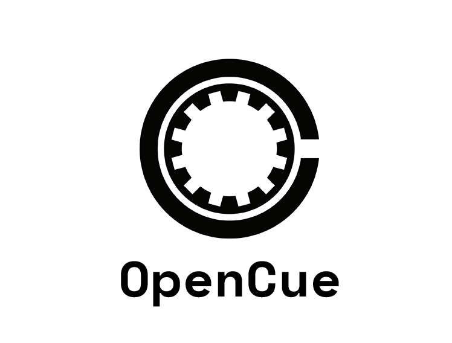

## Academy Software Foundation (ASWF) Incubating Project Logos

*Note: GitHub Flavored Markdown used in the Readme doesn't support background colors. The white logos below are displayed on the light grey of tables.*

### OpenCue Logos

<table class="logos-table">
	<thead>
        <tr>
            <th></th>
            <th>PNG</th>
            <th>SVG</th>
        </tr>
    </thead>
    <tbody>
        <tr>
            <th>color</th>
            <td></td>
            <td></td>
        </tr>
        <!-- <tr>
            <th>black</th>
            <td></td>
            <td></td>
        </tr>
        <tr>
            <th>white</th>
            <td></td>
            <td></td>
        </tr> -->
    </tbody>
</table>

### Open Shading Language Logos

<table class="logos-table">
	<thead>
        <tr>
            <th></th>
            <th>PNG</th>
            <th>SVG</th>
        </tr>
    </thead>
    <tbody>
        <tr>
            <th>color</th>
            <td></td>
            <td></td>
        </tr>
        <!-- <tr>
            <th>black</th>
            <td></td>
            <td></td>
        </tr>
        <tr>
            <th>white</th>
            <td></td>
            <td></td>
        </tr> -->
    </tbody>
</table>

### OpenTimelineIO Logos
<table class="logos-table">
	<thead>
        <tr>
            <th></th>
            <th>PNG</th>
            <th>SVG</th>
        </tr>
    </thead>
    <tbody>
        <tr>
            <th>color</th>
            <td></td>
            <td></td>
        </tr>
        <!-- <tr>
            <th>black</th>
            <td></td>
            <td></td>
        </tr>
        <tr>
            <th>white</th>
            <td></td>
            <td></td>
        </tr> -->
    </tbody>
</table>
